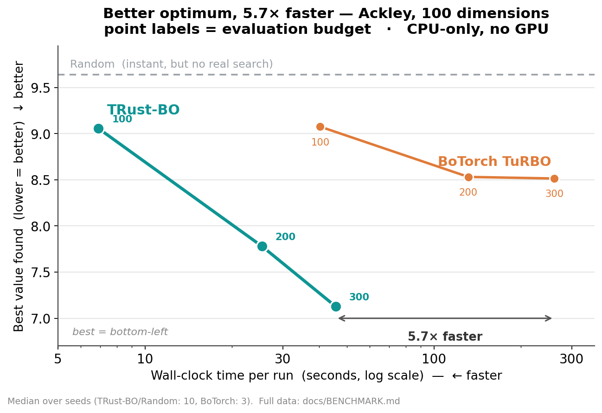

# TRust-BO

**[English](README.md) | [日本語](README.ja.md) | [简体中文](README.zh.md)**

**在你手头现有的硬件上就能运行的贝叶斯优化。**

> **TRust-BO 不是 CFD 求解器。** 它运行在优化循环内部——不会取代 CFD 求解器本身，
> 而是减少设计搜索过程中所需的 CFD 运行次数。

[](https://github.com/K092203/TRust-BO/actions/workflows/ci.yml)
[](LICENSE)
[]()
[]()

---

## 为什么要做这个

最好的设计不应该需要最好的硬件。

长期以来，CFD 优化一直被 HPC 集群、工作站和机构预算所限制——这些工具固然出色，
但对大多数人来说遥不可及。TRust-BO 是一名高中生为解决一个具体问题而开发的：
在没有 GPU 的笔记本电脑上，优化 Formula Student 赛车的空气动力学性能。
目标是让贝叶斯优化足够快，可以在任何地方运行；足够简单，不需要博士学位也能使用；
并且足够准确，能在真实的工程工作中发挥作用。

TRust-BO 是一个用 **Rust 编写的信赖域贝叶斯优化引擎**，通过 PyO3 暴露给 Python 使用。
不需要 GPU，不需要云端。执行 `pip install trust-bo` 即可在本地运行。

**具体来说，它能做什么:** 在高维(≥50D)问题，*或者*带噪声/带约束的问题
(例如真实 CFD)上，TRust-BO 的运行速度**比 BoTorch TuRBO 快 5–10 倍，同时达到相当或更好的质量**。
在低维、平滑、小预算的问题上，基于 GP 的方法(BoTorch、HEBO)通常是更好的选择——
TRust-BO 并不宣称在所有场景下都是最优的。诚实、有数据支撑的详细评估见
[docs/PERFORMANCE_ASSESSMENT.md](docs/PERFORMANCE_ASSESSMENT.md)(英文)。

> **基准测试范围(比较之前请先阅读):** 以下结果是与 **BoTorch TuRBO、CMA-ES、
> Random Search 和 NSGA-II** 对比测量得到的。与 **SAASBO**(一个强力的高维 BO 基线)
> 的对比是**未来的工作**。CFD 基准测试使用了**3 个随机种子**，多目标测试使用了
> **2 个随机种子**；为了统计上的严谨性，计划增加更多种子。

---

## 与其他方法的比较

| 特性 | **TRust-BO** | BoTorch | HEBO | Optuna |
|---|:---:|:---:|:---:|:---:|
| 需要 GPU | ✗ | 可选 | ✗ | ✗ |
| 针对 CPU 优化的核心 | ✓ (Rust) | △ | △ | ✓ |
| 支持高维(50D+) | ✓ | ✓ | △ | △ |
| 极简的 ask/tell API | ✓ | △ | △ | ✓ |
| 专注 CFD 工作流 | ✓ | ✗ | ✗ | ✗ |

> BoTorch 和 Optuna 同样可以用于 CFD 驱动的优化。TRust-BO 的设计目标非常明确：
> 面向学生和小型工程团队，提供一个轻量级、CPU 优先的工作流程。

---

## 安装

```bash
pip install trust-bo
```

已为 Linux、macOS 和 Windows 发布了预编译的 wheel 包(abi3, Python ≥3.9)——
正常安装无需 Rust 工具链。

如需从源码构建(需要 [Rust 工具链](https://rustup.rs/)):

```bash
git clone https://github.com/K092203/TRust-BO
cd TRust-BO
python -m venv .venv && source .venv/bin/activate
pip install .
```

开发时推荐使用 [maturin](https://github.com/PyO3/maturin) 以加快重新构建速度：
`pip install maturin && maturin develop --release`。

---

## 用法

```python
from trust_bo import TRustBOEngine, Float

# 1. 定义搜索空间
space = [Float(f"x{i}", -5.0, 5.0) for i in range(10)]

# 2. 创建引擎
engine = TRustBOEngine(space=space, direction="minimize", seed=42)

# 3. ask → evaluate → tell
for _ in range(20):                          # 20 轮 × batch_size=10
    candidates = engine.ask(batch_size=10)   # 提议下一批候选点
    results = [
        {"value": your_cfd_solver(c), "feasible": True}
        for c in candidates
    ]
    engine.tell(candidates, results)         # 将结果反馈给引擎

# 4. 获取最优结果
print(engine.best())
# {'parameters': {'x0': 0.12, ...}, 'objective_values': [3.47]}
```

### 带约束

```python
engine.tell(candidates, [
    {"value": solver(c), "feasible": constraint_ok(c)}
    for c in candidates
])
```

### 多目标优化(帕累托)

通过 `MultiObjectiveEngine` 同时优化多个目标。`method="ehvi"` 使用 Rust 实现的
闭式解 2 目标 Expected Hypervolume Improvement；`method="chebyshev"` 使用标量化方法
(支持任意数量的目标)。

```python
from trust_bo import MultiObjectiveEngine, Float

space = [Float(f"x{i}", 0.0, 1.0) for i in range(20)]
engine = MultiObjectiveEngine(
    space=space, directions=["maximize", "minimize"],  # 例如 Cl ↑, Cd ↓
    method="ehvi", seed=0,
)
for _ in range(15):
    cands = engine.ask(batch_size=4)
    results = [{"values": [cl(c), cd(c)], "feasible": True} for c in cands]
    engine.tell(cands, results)

print(engine.pareto_front())                 # 非支配设计集合
print(engine.hypervolume(ref=[0.0, 0.05]))   # 质量指标
```

### 保存与恢复

```python
engine.save("study.zip")
engine = TRustBOEngine.load("study.zip")
```

### 作为 Optuna 采样器使用

可将 TRust-BO 作为 [Optuna](https://optuna.org/) 的即插即用采样器。需要 `pip install optuna`。

```python
import optuna
from trust_bo.integrations.optuna import TrustBoOptunaSampler

study = optuna.create_study(direction="minimize", sampler=TrustBoOptunaSampler(seed=42))

def objective(trial):
    x = [trial.suggest_float(f"x{i}", -5.0, 5.0) for i in range(10)]
    return sum(v**2 for v in x)

study.optimize(objective, n_trials=100)
print(study.best_value)
```

---

## 基准测试



完整数据和方法论: [docs/BENCHMARK.md](docs/BENCHMARK.md)、
[docs/PERFORMANCE_ASSESSMENT.md](docs/PERFORMANCE_ASSESSMENT.md)(均为英文)。
对比对象为 **BoTorch TuRBO、CMA-ES、Random Search、NSGA-II**；与 SAASBO 的对比是未来工作。

### 合成高维函数(优势领域)

Ackley / Rastrigin / Levy，50D 和 100D，预算 100–500，`enable_phase2=True`。
数值越小越好。质量指标为各随机种子最优值的中位数；速度指标为单次运行的实际耗时。

| 条件 | TRust-BO | BoTorch TuRBO | 质量 | 速度 |
|---|:---:|:---:|:---:|:---:|
| Ackley 50D, b=300 | **5.96** | 7.25 | TRust | **8.9×** |
| Levy 50D, b=300 | **152.4** | 194.5 | TRust | **10.7×** |
| Ackley 100D, b=300 | **7.13** | 8.51 | TRust | **5.7×** |
| Levy 100D, b=300 | **284.1** | 723.2 | TRust | **5.7×** |
| Ackley 50D, b=500 | **4.64** | 6.38 | TRust | — |

在中等预算的 18 个条件中，TRust-BO 赢了 **16 个**；在 budget=500 的 5 个条件中，
**全部 5 个**都获胜，同时运行速度快 **5–10 倍**。唯一的失利出现在 budget=100 的
Rastrigin 问题上(小预算场景是 GP 方法的优势区间)。

### 真实 CFD —— 翼型形状优化

**H-1(NeuralFoil, 16D CST, 最大化 Cl/Cd, 10 个随机种子):** 干净的代理模型，问题设定良好。

| 方法 | Cl/Cd 中位数 | 最优值 |
|---|:---:|:---:|
| BoTorch TuRBO | **241.4** | 245.4 |
| **TRust-BO+P2** | 227.9 | **267.4** |
| CMA-ES | 223.3 | 265.5 |
| Random | 148.7 | 161.1 |

在 16D 平滑问题上，BoTorch 在中位数上领先；而 TRust-BO 找到了单次运行中的最优设计。

> 该结果在当时的默认设置 `acquisition="ei"` 下测得。当前的默认设置是 `"ts"`，
> 在同样平滑的 CST 16D Cl/Cd 目标上的另一组 A/B 测试中表现不及 `"ei"`
> (见 [docs/BENCHMARK.md §15](docs/BENCHMARK.md)，该测试的随机种子/预算与上表不同，
> 因此上表中 227.9 这一具体数值本身在当前默认设置下并不能预期复现)——
> 对于 CFD 形状类目标函数，建议显式传入 `config={"acquisition": "ei"}`。

**H-2(SU2 RANS, 真实纳维-斯托克斯方程, 16D, 3 个随机种子):** 带噪声、受网格约束。

| 方法 | Cl/Cd 中位数 | 落在物理合理范围内的种子数 |
|---|:---:|:---:|
| **TRust-BO+P2** | **171.6** | **3 / 3** |
| BoTorch TuRBO | 126.1 | 3 / 3 |
| CMA-ES | 774.6 ⚠ | 1 / 3 |
| Random | 316.1 ⚠ | 1 / 3 |

在更难、噪声更大的 RANS 问题上，TRust-BO 领先(+36%)，且是最稳定的方法。

> ⚠ **关于 SU2(H-2)示例的说明:** 上表中标 ⚠ 的数值是在 SU2 流程加入 fail-fast
> 几何校验(最小厚度/面积、自相交)与 `min_cd` 下限**之前**测得的历史数值，
> 在当前的可行性检查下并不能复现(见[已知局限](#已知局限))。
> **如需干净、开箱即用的 CFD 示例，请优先使用 NeuralFoil(H-1)流程。**

### 多目标优化(同时 Cl↑ 和 Cd↓)

在 SU2 上对比 Rust 实现的闭式解 2 目标 EHVI(Expected Hypervolume Improvement)
与 Chebyshev 标量化方法(budget=60, **2 个随机种子**): EHVI 的超体积中位数为
**0.0239，对比 0.0165(+45%)**。Chebyshev 得到的帕累托前沿多样性更高。
详见 [docs/BENCHMARK.md](docs/BENCHMARK.md)。

### 原生 Phase 2

一个纯 Rust 实现的 Matern 5/2 微型 GP，在最优点附近拟合 MLP 集成模型的*残差*，
用于收尾阶段的精细化。只需一个开关，不需要 sklearn，无额外依赖:

```python
engine = TRustBOEngine(space=space, config={"enable_phase2": True})
```

> **何时使用 TRust-BO:** 高维(50D+)问题，*或者*带噪声/带约束的问题，
> 中到大预算(100–1000)，以及任何单次 BO 迭代耗时很重要的场景——
> 例如 CFD 中每次评估本身就要花费数分钟到数小时。

---

## 工作原理

TRust-BO 实现了 **TuRBO**(信赖域贝叶斯优化)算法，并配以自定义代理模型:

```
冷启动     →  Halton 拟随机采样(n_init 个点)
热启动路径 →  MLP 自助法集成代理模型(5 个成员)
            + 信赖域内的交叉熵方法(CEM)
            + 信赖域动态调整(成功时扩张，失败时收缩)
```

关键设计选择:
- **Rust 核心** — 内层循环(代理模型训练、CEM、信赖域管理)通过 PyO3 由编译后的 Rust 代码执行，保持较低的 CPU 占用
- **热启动** — 代理模型的权重在各轮之间序列化保存，训练时间减少约 41%
- **中心稳定性** — 信赖域中心只有在相对改进 ≥1% 时才会移动，避免因微小波动导致不稳定
- **无需 GPU** — 使用 `burn` 的 `ndarray` 后端；一台现代笔记本电脑的 CPU 就足够了

---

## 路线图

### 当前版本(v0.3.0)
- [x] 单一信赖域(专注开发利用) + TuRBO-M 多信赖域(实验性)
- [x] 带热启动的 MLP 自助法集成代理模型
- [x] 约束处理(可行性代理模型) + 面向 CFD 的快速失败几何形状约束(最小厚度/面积，网格生成前)
- [x] 128 项测试套件(Python 84 项 + Rust 44 项)，仅需 CPU，PyO3 Python 绑定
- [x] 与 BoTorch TuRBO / CMA-ES / HEBO / Random / NSGA-II 的基准对比
- [x] 原生 Phase 2(Rust Tandem Residual-GP): 50D 提升 +32%，10D 提升 +55%，零额外依赖
- [x] 面向高开销求解器的异步并行/滚动评估(支持 SLURM)
- [x] 多保真度级联(LF→HF，在 NeuralFoil 上减少 70% 的高保真度评估)
- [x] 真实 CFD 翼型优化 —— NeuralFoil(H-1)**与** SU2 RANS(H-2)两条流程
- [x] 多目标优化: Chebyshev 标量化 + Rust 实现的闭式解 2 目标 EHVI
- [x] Optuna 采样器集成
- [x] PyPI 发布(为 Linux/macOS/Windows 提供预编译 abi3 wheel)

### 计划中
- [ ] 与 SAASBO 的对比 + 增加基准测试的随机种子数(统计严谨性)
- [ ] 支持超过 2 个目标的闭式解 EHVI(Chebyshev 标量化目前已支持任意数量的目标)
- [ ] 多信赖域(TuRBO-M) —— 优先级已下调；在 CFD 规模的预算下单一信赖域更稳定
- [ ] 撰写关于轻量级 BO 应用于工程设计的研究报告

---

## 常见问题

### TRust-BO 是 CFD 求解器吗？
不是。TRust-BO 是与外部 CFD 求解器**配合使用**的优化器，本身不求解纳维-斯托克斯方程。
它负责决定接下来应该评估哪些设计候选，从而减少昂贵 CFD 运行的总次数。

### 为什么不直接用 BoTorch？
BoTorch 非常出色，也远比 TRust-BO 灵活。TRust-BO 并不是要取代它，而是一个更小、
以 CPU 为优先、拥有简单 ask/tell API 的引擎，专为学生和小型团队的轻量级
CFD 驱动工作流而设计。

### 是否在真实 CFD 上验证过？
是的，在翼型形状优化上验证过。项目自带两条流程：**NeuralFoil**
(H-1，一个快速的学习型气动代理模型)和 **SU2 RANS**
(H-2，真实的定常纳维-斯托克斯方程，Ma=0.3，Re=3×10⁶，SA 湍流模型)。
详见"基准测试"章节和 [docs/BENCHMARK.md](docs/BENCHMARK.md)。目前 SU2 验证使用了
3 个随机种子；计划增加更多种子以及与 SAASBO 的对比。

### 这个项目适合谁？
适合学生、Formula Student 车队，以及希望在没有 HPC 或 GPU 的条件下
进行 CFD 驱动设计优化的小型工程团队。

### 与 BoTorch / HEBO / Optuna 是什么关系？
它们都是出色的优化器，TRust-BO 并不打算取代它们。TRust-BO 聚焦于一个特定的空白：
一个仅需 CPU、轻量级、专为 CFD 驱动的工程设计工作流打包的优化器。

---

## 已知局限

- **相对 GP 的代理模型精度:** MLP 自助法集成模型以不确定性校准精度换取速度。在低维、平滑、小预算的问题上，基于 GP 的方法(BoTorch、HEBO)通常表现更好(已在 16D NeuralFoil 基准测试中证实)。TRust-BO 的优势在于 50D 以上或带噪声/带约束的问题。
- **基准测试的随机种子数:** 合成函数结果使用了 10 个随机种子，但真实 CFD(SU2)只用了 3 个，多目标测试只用了 2 个——统计上较为单薄。计划增加更多种子。
- **尚未与 SAASBO 对比:** 尚未与强力的高维 BO 基线 SAASBO 进行基准对比(受环境限制)。目前的结论仅限于与 BoTorch TuRBO / CMA-ES / Random / NSGA-II 的比较。
- **CFD 可行性检查存在已知缺口:** SU2(H-2)流程现在会在网格生成前对无效几何形状(最小厚度/面积、自相交)进行快速失败检查，并事后拒绝低于阈值的非物理 `Cd` 值，从而封堵了此前观察到的主要一类伪影问题(见 [docs/BENCHMARK.md](docs/BENCHMARK.md) §20.3)。在从零构建的 FSAE 前翼实用验证流程(65 维，SU2 `INC_RANS`)所用的、更粗糙的 3D 前翼
网格上仍存在一定的残余风险(见
[docs/BENCHMARK.md §24](docs/BENCHMARK.md#24-2026-07-16-3dフロントウィング最適化パイプライン実用検証-成功初の3d-cfd実行))。
- **多目标优化中 EHVI 仅支持 2 个目标:** 闭式解 EHVI 仅限 2 个目标；3 个及以上目标请使用 Chebyshev 标量化方法。
- **热启动权重传输:** 代理模型权重以十六进制字符串形式序列化(每轮约 1 MB)。可用但效率不高，计划引入二进制传输机制。
- **多信赖域(`n_trs > 1`)为实验性功能:** 已实现并测试，但由于在 CFD 规模的预算下单一信赖域更稳定，优先级已下调。

---

## 开发日志

包含设计决策、各阶段实验和基准测试记录的完整开发历史保存在
[docs/DEVELOPMENT.md](docs/DEVELOPMENT.md)(日文)中。

---

## 贡献

欢迎参与贡献。目前这是一个个人项目，任何形式的帮助——错误报告、真实问题上的基准测试结果、
文档、代码——都非常感谢。

如果你在实际 CFD 问题中使用了 TRust-BO 并得到了结果(无论好坏)，欢迎提交 issue 分享。
在这个阶段，真实世界的反馈是最有价值的东西。

---

## License

MIT © 2026 Kotaro Ozawa
